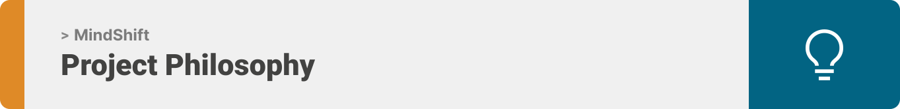
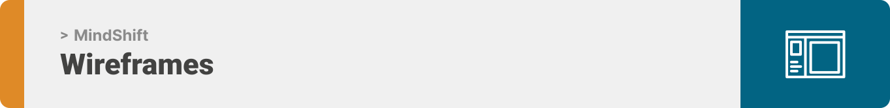
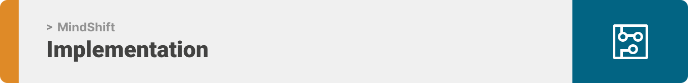
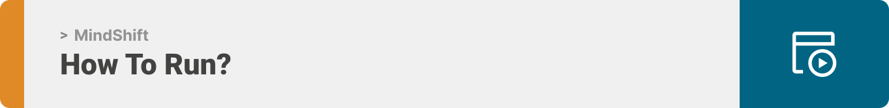

<div align="center">

> The project is a web application related to gamification at work, implemented by incorporating gaming elements in non-gaming situations.  


**[PROJECT PHILOSOPHY](#project-philosophy) • [WIREFRAMES](#wireframes) • [TECH STACK](#tech-stack) • [IMPLEMENTATION](#implementation) • [HOW TO RUN?](#how-to-run)**

</div>

<br><br>



<a id="project-philosophy"></a>

> Gamification has become very popular and an integral part of the corporate world. Many companies are adopting it as it is an innovative approach and has lot of benefits on all levels. Not only it promotes employee loyalty and engagement by making work processes fun and rewarding but also it increases productivity driving better results to the company.
> 
> The project is about gamification at work, which increases employees motivation and loyalty to the company, ensure a fun learning environment, enhance engagement, and help employees learn skills more efficiently.

<br>

### User Stories
- As a user, I want to gain rewards on my hard work.
- As a user, I want to check my progress at my company.
- As a user, I want to see the company's leaderboard.

### Admin Stories
- As an admin , I want to increase my employees' motivation and progress at work.
- As an admin , I want to ensure a fun learning environment.
- As an admin , I want to enhance my employees' engagement.
- As an admin , I want to help employees' learn skills more efficiently.


<br><br>


<a id="wireframes"></a>

> This design was planned before on paper, then moved to Figma app for the fine details.
Note that I didn't use any styling library or theme, all from scratch and using pure css modules.

| Landing  | Home |
| ---------|------|
|  |  |
|  Questions | Profile |
|  |  |
|     Rewards      |
|  | 


<br><br>


<a id="tech-stack"></a>

Here's a brief high-level overview of the tech stack the MindShift app uses:

- This project uses the [React library](https://reactjs.org/). React is a free and open-source front-end JavaScript library for building user interfaces based on UI components. It is maintained by Meta and a community of individual developers and companies.
- As backend, [Laravel framework](https://laravel.com/) is used, which is a free and open-source PHP web framework, intended for the development of web applications following the model–view–controller architectural pattern and based on Symfony.
- For persistent storage (database), the app uses [MySQL](https://www.mysql.com) which is an open-source relational database management system. Its name is a combination of "My", the name of co-founder Michael Widenius's daughter, and "SQL", the abbreviation for Structured Query Language.


<br><br>

<a id="implementation"></a>

> Using the above mentioned tech stacks and the wireframes built with figma, the implementation of the app is shown as below. These are screenshots from the real app

- Implemented live scoring system

- Removing employee


>User Page:

| Landing  | Home  |
|----------|-------|
|  |  |
|Questions | Profile |
|  | |
| Rewards | Order |
|  |  |
| Chatbot |
|  |

>Admin Page:

| Dashboard  | Employees | 
|------------|-----------|
|  |   |
| Add Game | Add Badge  |  
| |  |
| Add Points | Add Rewards|
|  |  |
| Add Questions |
|  |

<br><br>

<a id="how-to-run"></a>


> To get a local copy up and running follow these simple example steps.

### Prerequisites


* npm
  ```sh
  npm install npm@latest -g
  ```

### Installation


1. Clone the repo.
   ```sh
   git clone https://github.com/vladimir-mawla/MindShift.git
   ```
2. Add your DataBase name in the .env file locataed at 'mindshift-backend/.env'.

   DB_DATABASE= 'yourdb'

3. Install NPM packages in 'mindshift-frontend' folder.
   ```sh
   npm install
   ```
4. Start the Server in 'mindshift-backend' folder.
   ```sh
   php artisan serve
   ```
5. Start the Application 'mindshift-frontend' folder.
   ```sh
   npm start
   ```
